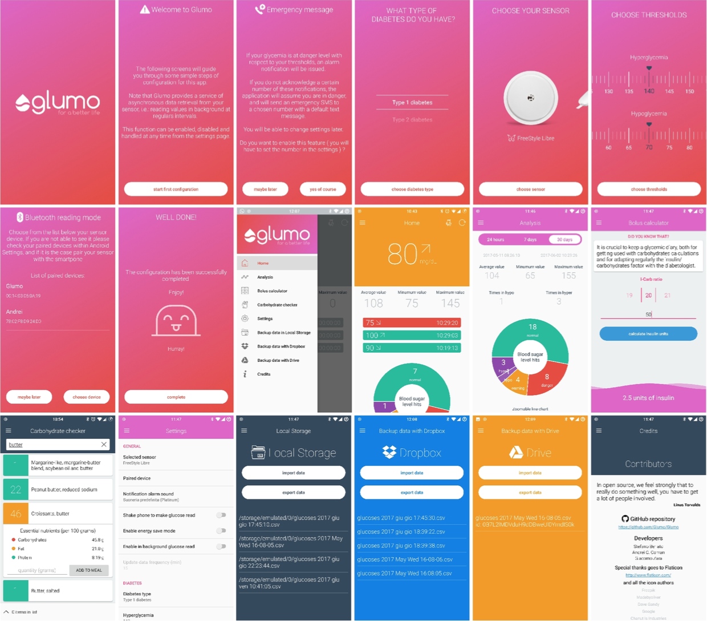
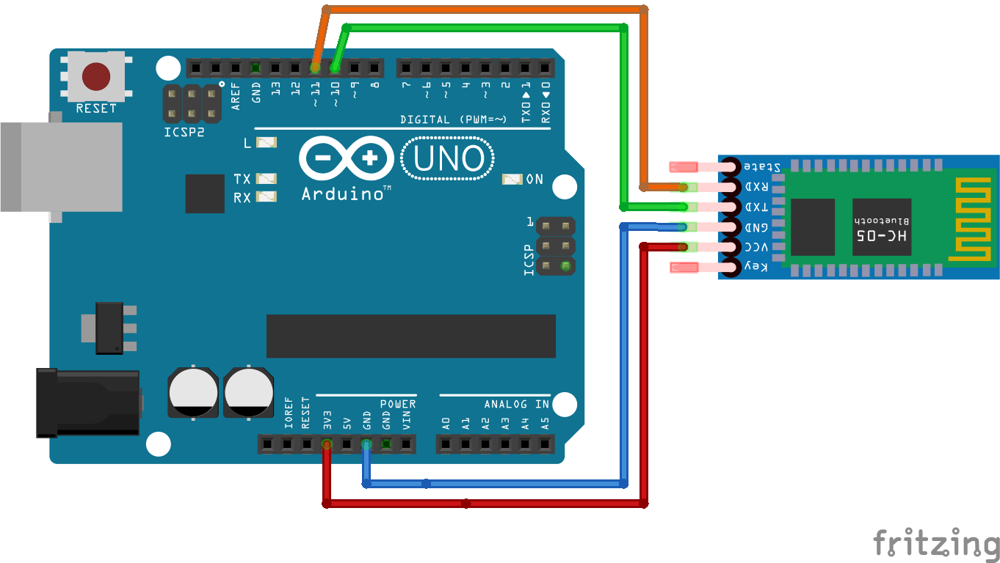

# Glumo #

### LPSMT 2017

#### Contributors
* Stefano Berlato
* Andrei Catalin Coman
* Giacomo Zara

#### Give your contribution!
> You're going to make a difference. A lot of times it won't be huge, it won't be visible even. But it will watter just the same. Don't do it for praise or money, that's what I want to tell you. Do it because it needs to be done. Do it to make your world better.
 <b>Commissioner James Gordon (Batman)

#### Description

Glumo is meant to be a tool of support for people who suffer from diabetes, providing a monitoring service for the glycemic levels. With its functionalities, based upon a direct connection with the sensor, and bypassing the need of a further glucometer, it replaces traditional methods such as lancing devices and reactive stripes.
 
 
Our solution consists of an app that provides a user-friendly representation of glucose readings, by asynchronously polling the sensor via Bluetooth connection. Moreover, the app offers functionalities such as acoustic alarms for notifying the trespassing of glycemic thresholds, emergency SMS messages in case of not acknowledged danger values, graphical representation of the history, export and import of data, bolus calculus and check upon carbohydrates levels in food.

#### Screenshots

#### Arduino wiring

In the Arduino folder you can find the code for the board and the schematic.

#### DEMO

In the Glumo folder you can find the APK of the app.

<b>NOTE:</b> If you directly compile the source code and create your own APK, be aware that
Google Drive backup functionality needs a glumostaff registered fingerprint(SHA-1) to properly work.

#### YouTube

